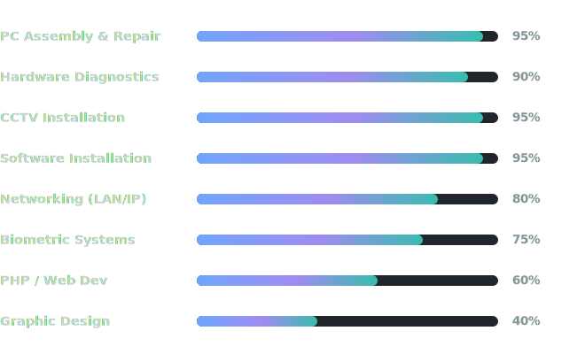

<!-- ═══════════════════════════════════════════════════════════════ -->
<!--  Chandirakumar Powsikan — GitHub Profile README                -->
<!--  Setup: commit this file AND the /assets folder (4 SVGs) to    -->
<!--  the root of the Powsi06/Powsi06 repository so the relative    -->
<!--  asset paths below resolve correctly on both themes.           -->
<!-- ═══════════════════════════════════════════════════════════════ -->
<!--                     HERO BANNER                                -->
<!-- ═══════════════════════════════════════════════════════════════ -->
<p align="center">
  
</p>

<!-- ═══════════════════════════════════════════════════════════════ -->
<!--                   BADGES ROW                                   -->
<!-- ═══════════════════════════════════════════════════════════════ -->
<p align="center">
  
  &nbsp;
  
  &nbsp;
  
  &nbsp;
  
  &nbsp;
  
</p>

<!-- HIRE ME BUTTON -->
<p align="center">
  <a href="mailto:chandirakumar.powsikan@gmail.com">
    
  </a>
</p>

<!-- SOCIAL LINKS -->
<p align="center">
  <a href="mailto:chandirakumar.powsikan@gmail.com">
    
  </a>
  &nbsp;
  <a href="https://github.com/Powsi06">
    
  </a>
  &nbsp;
  <a href="https://www.linkedin.com/in/cpowsikan">
    
  </a>
</p>

<!-- TYPING HEADER — theme-safe: deep tones for light mode, bright tones for dark mode -->
<p align="center">
  <picture>
    <source media="(prefers-color-scheme: dark)" srcset="https://readme-typing-svg.demolab.com?font=JetBrains+Mono&weight=700&size=24&duration=3000&pause=1000&color=70A5FD&center=true&vCenter=true&width=800&lines=Computer+Hardware+Technician+%F0%9F%94%A7;PC+Builder+%7C+Troubleshooter+%7C+Repair+Expert+%F0%9F%96%A5%EF%B8%8F;CCTV+%7C+Networking+%7C+Biometric+Systems+%F0%9F%93%A1;NVQ+Level+4+Certified+%7C+Pursuing+NVQ+Level+5+%F0%9F%8E%93;Open+to+Freelance+%26+Full-Time+Work+%F0%9F%9A%80;Welcome+to+my+GitHub+Profile!+%F0%9F%91%8B"/>
    <source media="(prefers-color-scheme: light)" srcset="https://readme-typing-svg.demolab.com?font=JetBrains+Mono&weight=700&size=24&duration=3000&pause=1000&color=1D4ED8&center=true&vCenter=true&width=800&lines=Computer+Hardware+Technician+%F0%9F%94%A7;PC+Builder+%7C+Troubleshooter+%7C+Repair+Expert+%F0%9F%96%A5%EF%B8%8F;CCTV+%7C+Networking+%7C+Biometric+Systems+%F0%9F%93%A1;NVQ+Level+4+Certified+%7C+Pursuing+NVQ+Level+5+%F0%9F%8E%93;Open+to+Freelance+%26+Full-Time+Work+%F0%9F%9A%80;Welcome+to+my+GitHub+Profile!+%F0%9F%91%8B"/>
    
  </picture>
</p>

---

<!-- ═══════════════════════════════════════════════════════════════ -->
<!--                   ABOUT ME                                     -->
<!-- ═══════════════════════════════════════════════════════════════ -->

<table>
<tr>
<td valign="top" width="60%">

```python
class Powsikan:
    def __init__(self):
        self.name        = "Chandirakumar Powsikan"
        self.alias       = "Powsi 💻"
        self.role        = "Hardware Technician & Sales Assistant"
        self.company     = "JP Technologies (2023 – Present)"
        self.experience  = "3+ Years in IT Hardware"
        self.skills      = [
            "PC Assembly & Repair 🔧",
            "Hardware Diagnostics 🩺",
            "Networking (LAN/IP/Router) 🌐",
            "CCTV Installation 📷",
            "Biometric Systems 🔐",
            "Remote Support (TeamViewer/AnyDesk) 🖥️",
        ]
        self.learning    = [
            "NVQ Level 5 – ICT @ German Tech 🎓",
            "Software Development 💡",
            "Graphic Designing 🎨",
        ]
        self.languages   = ["Tamil 🗣️ Fluent", "English 📖 Basic"]
        self.fun_fact    = "I diagnose dead PCs faster than you Google! 😄"
        self.available   = True  # Open to work!

    def motto(self):
        return "Fix it. Build it. Improve it. 🔧"

me = Powsikan()
print(me.motto())
```

</td>
<td valign="top" width="40%" align="center">
  <picture>
    <source media="(prefers-color-scheme: dark)" srcset="assets/circuit-dark.svg"/>
    <source media="(prefers-color-scheme: light)" srcset="assets/circuit-light.svg"/>
    
  </picture>
  <br/>
  
</td>
</tr>
</table>

---

<!-- ═══════════════════════════════════════════════════════════════ -->
<!--                   TECH & TOOLS                                 -->
<!-- ═══════════════════════════════════════════════════════════════ -->

## 🛠️ Tech & Tools

<div align="center">

**💻 Programming & Web**


**🔧 Hardware & Networking**


**🖥️ Software & Tools**


</div>

---

<!-- ═══════════════════════════════════════════════════════════════ -->
<!--                  SKILL PROFICIENCY                             -->
<!-- ═══════════════════════════════════════════════════════════════ -->

## 📊 Skill Proficiency

<div align="center">
  <picture>
    <source media="(prefers-color-scheme: dark)" srcset="assets/skill-bars-dark.svg"/>
    <source media="(prefers-color-scheme: light)" srcset="assets/skill-bars-light.svg"/>
    
  </picture>
</div>

---

<!-- ═══════════════════════════════════════════════════════════════ -->
<!--                  SERVICES                                      -->
<!-- ═══════════════════════════════════════════════════════════════ -->

## 🛎️ Services I Offer

<div align="center">

| 🔧 Service | 📋 Details |
|:----------:|:----------|
| 💻 **PC & Laptop Repair** | Diagnosing & fixing hardware faults — RAM, HDD, Motherboard, GPU |
| 🖥️ **Custom PC Building** | Assembly with compatibility checking & professional cable management |
| 📡 **Network Setup** | LAN, IP configuration, Router setup, Wi-Fi troubleshooting |
| 📷 **CCTV Installation** | Full CCTV system setup, configuration & ongoing maintenance |
| 🔐 **Biometric Systems** | Fingerprint scanner & attendance system installation |
| 🖨️ **Printer Setup** | Installation, driver configuration & troubleshooting |
| 🖥️ **Remote Support** | TeamViewer / AnyDesk remote diagnosis & repair |
| 💿 **OS Installation** | Windows, drivers & essential software setup |

</div>

---

<!-- ═══════════════════════════════════════════════════════════════ -->
<!--                  GITHUB STATS                                  -->
<!-- ═══════════════════════════════════════════════════════════════ -->

## 📊 GitHub Stats

<div align="center">
  <a href="https://github.com/Powsi06">
    
  </a>
  &nbsp;
  <a href="https://github.com/Powsi06">
    
  </a>
</div>

---

<!-- ═══════════════════════════════════════════════════════════════ -->
<!--                  STREAK STATS                                  -->
<!-- ═══════════════════════════════════════════════════════════════ -->

## 🔥 Streak Stats

<div align="center">
  
</div>

---

<!-- ═══════════════════════════════════════════════════════════════ -->
<!--               CONTRIBUTION ACTIVITY                            -->
<!-- ═══════════════════════════════════════════════════════════════ -->

## 📈 Contribution Activity

<div align="center">
  
</div>

---

<!-- ═══════════════════════════════════════════════════════════════ -->
<!--                  CONTRIBUTION HEATMAP                          -->
<!-- ═══════════════════════════════════════════════════════════════ -->

## 🌡️ Contribution Heatmap

<div align="center">
  
</div>

---

<!-- ═══════════════════════════════════════════════════════════════ -->
<!--                  SNAKE ANIMATION                               -->
<!-- ═══════════════════════════════════════════════════════════════ -->

## 🐍 Contribution Snake

<div align="center">
  <picture>
    <source media="(prefers-color-scheme: dark)" srcset="https://raw.githubusercontent.com/Powsi06/Powsi06/output/github-snake-dark.svg"/>
    <source media="(prefers-color-scheme: light)" srcset="https://raw.githubusercontent.com/Powsi06/Powsi06/output/github-snake.svg"/>
    
  </picture>
</div>

---

<!-- ═══════════════════════════════════════════════════════════════ -->
<!--                  TROPHY WALL                                   -->
<!-- ═══════════════════════════════════════════════════════════════ -->

## 🏆 Trophy Wall

<div align="center">
  
</div>

---

<!-- ═══════════════════════════════════════════════════════════════ -->
<!--                  WORK EXPERIENCE                               -->
<!-- ═══════════════════════════════════════════════════════════════ -->

## 💼 Work Experience

<details>
<summary>🏢 <strong>JP Technologies – Sri Lanka</strong> &nbsp;|&nbsp; Computer Hardware Technician & Sales Assistant &nbsp;|&nbsp; 📅 2023 – Present</summary>

<br/>

> `PC Repair` `Laptop Repair` `Networking` `CCTV` `Biometrics` `POS` `TeamViewer` `AnyDesk` `Software Installation` `Customer Service`

**🔧 As a Computer Hardware Technician:**
- Assembled, maintained, and repaired desktops and laptops for 50+ clients
- Diagnosed and resolved hardware issues: RAM, HDD, motherboard, GPU, peripherals
- Installed & configured CCTV systems, LAN/IP networking, routers, printers, fingerprint scanners and biometric attendance devices
- Provided fast remote support via TeamViewer/AnyDesk — reducing client downtime significantly
- Installed operating systems, drivers, and essential software for business and personal clients

**🛒 As a Sales Assistant:**
- Guided customers in selecting the right computer parts, accessories and upgrade options
- Explained technical product features in simple, client-friendly language
- Managed POS-based sales, invoicing, stock records and inventory updates
- Built long-term customer trust through quality after-sales service

</details>

---

<!-- ═══════════════════════════════════════════════════════════════ -->
<!--                  FEATURED PROJECTS                             -->
<!-- ═══════════════════════════════════════════════════════════════ -->

## 🚀 Featured Projects

<!-- TODO: point each project at its actual repo URL once published, e.g. https://github.com/Powsi06/pc-builder-pro -->
<div align="center">

| Project | Stack | Highlights |
|:-------:|:-----:|:----------|
| 🖥️ **[PC Builder Pro](https://github.com/Powsi06)** | PHP 8 · MySQL · MVC · OpenAI API | Sri Lanka market PC compatibility builder · 9 rule-type engine · AI chatbot ARIA · LKR pricing · CSRF security |
| 📸 **[Photography Studio Manager](https://github.com/Powsi06)** | PHP · Tailwind · MySQL | Studio billing system · HWID machine lock · License key generation · Key-based password reset |
| 🌐 **[Personal Portfolio](https://github.com/Powsi06)** | HTML · CSS · JS · Canvas | Dark cyber aesthetic · Particle canvas · Scroll animations · Mobile-first · Reduced-motion support |

</div>

---

<!-- ═══════════════════════════════════════════════════════════════ -->
<!--               ACHIEVEMENTS & CERTIFICATIONS                    -->
<!-- ═══════════════════════════════════════════════════════════════ -->

## 🎯 Achievements & Certifications

<div align="center">

| 🏅 | Achievement | Details |
|:--:|:-----------:|:--------|
| 📜 | **NVQ Level 4 – Computer Hardware Technician** | Certified by TVEC / VTA · 2023 ✅ |
| 🎓 | **NVQ Level 5 – ICT (Pursuing)** | German Tech Sri Lanka · 2025–Present 🔄 |
| 🔧 | **3+ Years Industry Experience** | JP Technologies · Hardware + Sales · 2023–Present |
| 🤖 | **Built AI-Powered App** | PC Builder Pro with ARIA chatbot (OpenAI API) |
| 🌐 | **Full-Stack Developer** | Custom MVC · Dynamic compatibility engine · 9 rule types |
| 🔐 | **Software Security** | HWID locking · License key generation · CSRF protection |

</div>

---

<!-- ═══════════════════════════════════════════════════════════════ -->
<!--                     EDUCATION                                  -->
<!-- ═══════════════════════════════════════════════════════════════ -->

## 🎓 Education

<div align="center">

| Qualification | Institution | Year | Result |
|:-------------:|:-----------:|:----:|:------:|
| O/L — Science · Maths · Tamil · English | Local School, Sri Lanka | 2017 | B · C · A · S |
| NVQ Level 4 – Computer Hardware Technician | VTA, Sri Lanka | 2023 | ✅ Certified |
| NVQ Level 5 – Information & Communication Technology | German Tech Sri Lanka | 2025–Present | 🔄 In Progress |

</div>

---

<!-- ═══════════════════════════════════════════════════════════════ -->
<!--                  CURRENTLY LEARNING                            -->
<!-- ═══════════════════════════════════════════════════════════════ -->

## 📚 Currently Learning

```
🖥️  Software Development  →  PHP · Python · JavaScript · MVC Architecture
🌐  Networking            →  LAN · IP Config · Router Setup · Subnetting
🎨  Graphic Designing     →  UI/UX · Figma · Visual Branding
🔐  System Security       →  HWID Lock · License Keys · CSRF Protection
🤖  AI Integration        →  OpenAI API · Chatbot Development (ARIA)
📱  Web Development       →  Tailwind CSS · Responsive Design · REST APIs
```

---

<!-- ═══════════════════════════════════════════════════════════════ -->
<!--                RANDOM TECH FACT                                -->
<!-- ═══════════════════════════════════════════════════════════════ -->

## ⚡ Random Tech Fact

<div align="center">
  <picture>
    <source media="(prefers-color-scheme: dark)" srcset="https://readme-typing-svg.demolab.com?font=JetBrains+Mono&size=13&duration=5000&pause=1000&color=38BDAE&center=true&vCenter=true&multiline=true&width=700&height=60&lines=💡+The+first+computer+bug+was+an+actual+bug+—+a+moth+found+in+a+relay+in+1947!;💡+The+word+'byte'+was+coined+to+avoid+confusion+with+the+word+'bit';💡+The+first+1GB+hard+drive+weighed+250kg+and+cost+%2440%2C000+in+1980!"/>
    <source media="(prefers-color-scheme: light)" srcset="https://readme-typing-svg.demolab.com?font=JetBrains+Mono&size=13&duration=5000&pause=1000&color=0F766E&center=true&vCenter=true&multiline=true&width=700&height=60&lines=💡+The+first+computer+bug+was+an+actual+bug+—+a+moth+found+in+a+relay+in+1947!;💡+The+word+'byte'+was+coined+to+avoid+confusion+with+the+word+'bit';💡+The+first+1GB+hard+drive+weighed+250kg+and+cost+%2440%2C000+in+1980!"/>
    
  </picture>
</div>

---

<!-- ═══════════════════════════════════════════════════════════════ -->
<!--                  CONNECT                                       -->
<!-- ═══════════════════════════════════════════════════════════════ -->

## 🌐 Connect with Me

<div align="center">

[](mailto:chandirakumar.powsikan@gmail.com)

[](https://github.com/Powsi06)

[](https://www.linkedin.com/in/cpowsikan)

<br/>

<!-- HIRE ME ANIMATED BUTTON -->
<a href="mailto:chandirakumar.powsikan@gmail.com">
  
</a>

</div>

---

<!-- ═══════════════════════════════════════════════════════════════ -->
<!--                  FOOTER                                        -->
<!-- ═══════════════════════════════════════════════════════════════ -->

<div align="center">
  <picture>
    <source media="(prefers-color-scheme: dark)" srcset="https://readme-typing-svg.demolab.com?font=JetBrains+Mono&size=14&duration=4000&pause=500&color=38BDAE&center=true&vCenter=true&width=600&lines=Thanks+for+visiting+my+profile!+%F0%9F%99%8F;Feel+free+to+connect+%F0%9F%A4%9D;Let%27s+build+something+great+together+%F0%9F%9A%80;Fix+it.+Build+it.+Improve+it.+%F0%9F%94%A7"/>
    <source media="(prefers-color-scheme: light)" srcset="https://readme-typing-svg.demolab.com?font=JetBrains+Mono&size=14&duration=4000&pause=500&color=0F766E&center=true&vCenter=true&width=600&lines=Thanks+for+visiting+my+profile!+%F0%9F%99%8F;Feel+free+to+connect+%F0%9F%A4%9D;Let%27s+build+something+great+together+%F0%9F%9A%80;Fix+it.+Build+it.+Improve+it.+%F0%9F%94%A7"/>
    
  </picture>
</div>

<p align="center">
  <i>"Fix it. Build it. Improve it. 🔧"</i>
  <br/>
  <sub>— Chandirakumar Powsikan</sub>
</p>

<p align="center">
  
</p>
